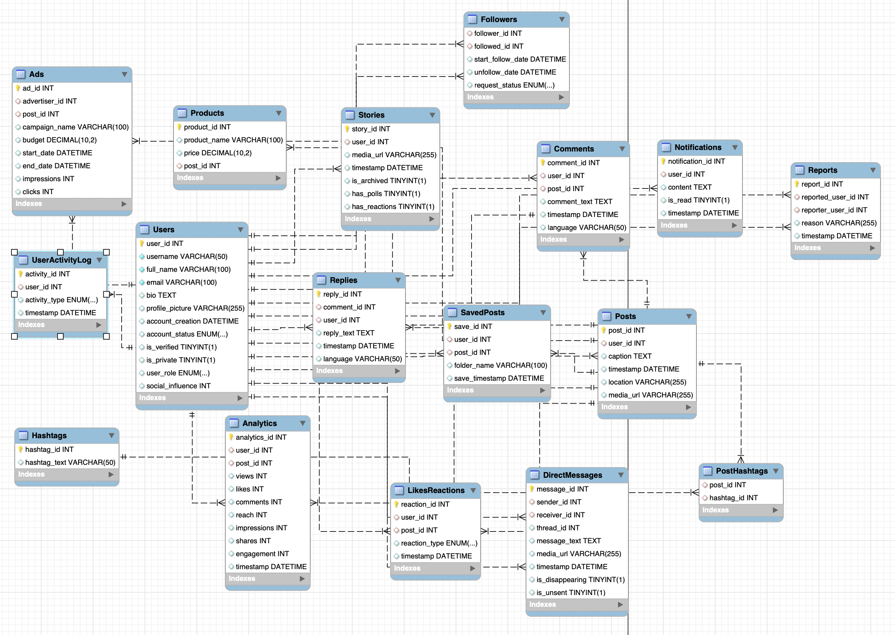

# Instagram Database Design (ER Model)

This project showcases a comprehensive database design for Instagram, covering the platform's key features such as users, posts, comments, likes, direct messaging, stories, and analytics.

## Database Structure

The database includes the following tables:
- Ads
- Analytics
- Comments
- DirectMessages
- Followers
- Hashtags
- LikesReactions
- Notifications
- PostHashtags
- Posts
- Products
- Replies
- Reports
- SavedPosts
- Stories
- UserActivityLog
- Users